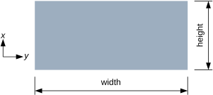
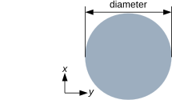
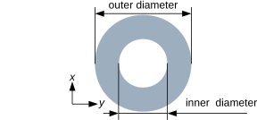

******************
Section Properties
******************

Sections relate the three-dimensional geometric properties to a lower dimensional approximation of a beam.

Beam
====
For each beam a name, type and the corresponding dimensions are required.

Rectangle
---------

A rectangular profile can be specified by defining ``rectangle`` as the profile type.  The dimensions ``width`` and ``height`` are required.  For example ::

    "profiles" : [{
      "name" : "steel_bar",
      "type" : "rectangle",
      "width" : 200,
      "height" : 200
    }]

Circle
------

A circular profile can be specified using ``circle``.  The ``diameter`` is required in this case.  For example ::

    "profiles" : [{
      "name" : "steel_bar",
      "type" : "circle",
      "diameter" : 200
    }]

Hollow Circle
-------------

Likewise, a hollow circular profile, (e.g. a pipe) can be specified using ``hollow_circle``.  An ``inner_diameter`` and ``outer_diameter`` are required, and the ``inner_diameter`` must be a smaller value than the ``outer_diameter``.  ::

    "profiles" : [{
      "name" : "steel_bar",
      "type" : "hollow_circle",
      "inner_diameter" : 100,
      "outer_diameter" : 200
    }]
